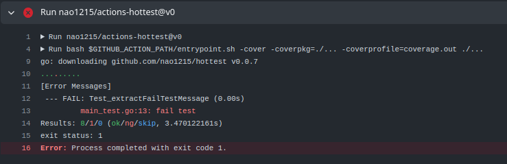

## actions-hottest - GitHub Actions for hottest
:octocat: GitHub Action for [nao1215/hottest](https://github.com/nao1215/hottest)

### Usage: sample workflow
You should set `args` argument same as `go test` command.  
`nao1215/actions-hottest` requires the permission to comment on pull requests in order to store test results as PR comments. Please enable the following settings: 
- [GitHub Repository Top Page] -> [Settings] -> [Actions] -> [General] -> [Read and write permissions] = ON

```yml
name: SampleTest

on:
  push:

jobs:
  sample_test:
    name: sample test

    strategy:
      matrix:
        platform: [ubuntu-latest]

    runs-on: ${{ matrix.platform }}

    steps:
      - uses: actions/checkout@v4

      - uses: actions/setup-go@v4
        with:
          go-version: "1"
          check-latest: true

      - uses: nao1215/actions-hottest@v1
        with:
          # This argument is same as `go test` command.
          args: '-cover -coverpkg=./... -coverprofile=coverage.out ./...'
```

### Result
The old PR comments created by `hottest` will be deleted when creating a new PR comment.
#### Success case


#### Failure case


